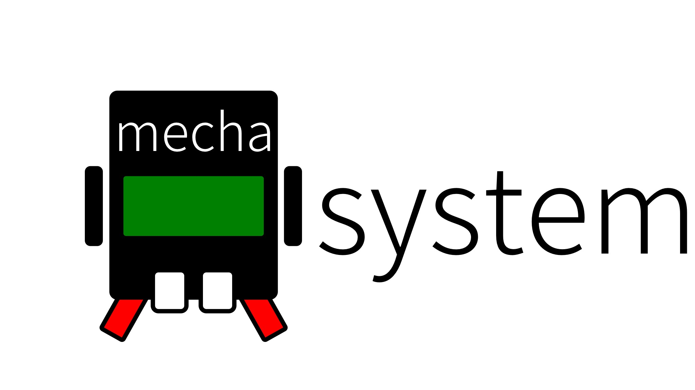

# MacroByte 

我們是在軟硬體領域都有涉獵的工程師，因緣際會下認識在高中任教的生活科技老師在上課有教材方面的需求，因此利用工作之餘研發教材，如今略有小成特撰文記之。
在與生活科技老師接觸之初，首先我們聽取老師在教學上遇到的問題，發現到除了學生自己動手做的簡易材料專題以外，如果要增加程式方面的控制以及連接各式各樣的感測器與馬達之類的材料，則顯得資源不足或是沒有立即產品可以對應。新課綱的內文強調整合的能力，因此我們認為不能用現成套件的方式來進行教學，而是要以導引方式引入工程思維，將機電整合的概念融入這套系統。同時為了要讓學生持續保有親自動手做的能力，我們也設立要能讓學生進行「改車」「改造」的目標。
在了解問題之後我們立刻尋找資料，包括2018即將上路的新課綱以及工程方面該如何對應的設計與備料，於是我們集思廣益出一套系統。其中包括控制板、擴展板、圖形化程式介面三大子系統。  
國內廠商聯發科有研發一款控制板名為7688DUO，是將聯發科7688晶片與ATMEL MEGA32U4結合在同一塊板子的雙晶片設計。是一款結合Arduino系列的簡便使用特性以及7688晶片功能強大的WiFi通訊與Linux系統運算能力的產品。我們認為很適合設計成為老師教學上的輔助教材。
經過數個月的研發之後，我們為7688DUO設計一塊擴充板，擴充板上有馬達驅動IC以及螺絲固定孔可以結合減速齒輪與輪子成為動力來源，另外7688DUO具有多樣的輸出入介面，我們也一一將它們延伸到擴展板上面，另外也預先留置許多螺絲孔位以便接合各式各樣的感測器或是不一樣的機構。  
在硬體與軟體的首次原型誕生之後，我們為它取了一個名字：MechaCar，Mecha代表機械（Mechanical）

首先7688DUO要改名稱為「macrobyte」  
storageXXXX/storage 放在 /www/cgi-bin/  
runPyuthon 放在 /www/cgi-bin/  
blockly 放在 /www/  
在/www/ 建立 save/ 資料夾  
MBdisplay.py 放在 /root/
websocket_server.py 放在 /root/

要預先安裝pymata  
pip install pymata  
  
blockly客製化的功能分別放在  
index.html  負責blockly的主畫面以及相關按鈕  
code.js  客製化功能的javascript程式所在與錨點的連結  
storage.js  負責將blockly的xml資料儲存起來的功能  
  
原理：
在客戶端瀏覽器網址列輸入 http://macrobyte.local/blockly/demos/code/  
連覽器會從macrobyte 下載blockly的頁面以及相關的javascript到瀏覽器  
macrobyte的畫面中有下載按鈕以及上傳按鈕  
下載按鈕會使用網頁錨點#last  
這個錨點會啟動下載機制將最後編輯的blockly xml資料下載到瀏覽器  
上傳按鈕有兩個功能  
一個是藉由ajax上傳機制 傳送xml到 /www/cgi-bin/storage  
功能是將現在瀏覽器中的blockly xml資料上傳到macrobyte  
並且存放在/www/save/last檔案中  
而舊的last檔案會另存成last.old  
  
這個last錨點( http://macrobyte.local/blockly/demos/code/#last) 是Blockly內部原生機制在處理  
在/www/cgi-bin/storage 這裡只是收到Blockly處理過的結果，以cgi的方式送來  
原本Blockly是利用這個機制處理Blockly雲端存檔的需求，在#之後是接一組號碼，然後後台把號碼對應的xml傳給用戶端  
這裡把它改成存檔機制  
  
上傳按鈕另一個功能是執行上傳的python程式  
blockly中的javscript程式會以POST方法  
將記憶體中的程式碼上傳給 /www/cgi-bin/runPython  
而runPython程式會將收到的程式碼放在/root/  
並取名為pythonCode.py  
然後呼叫python執行這個pythonCode.py  

